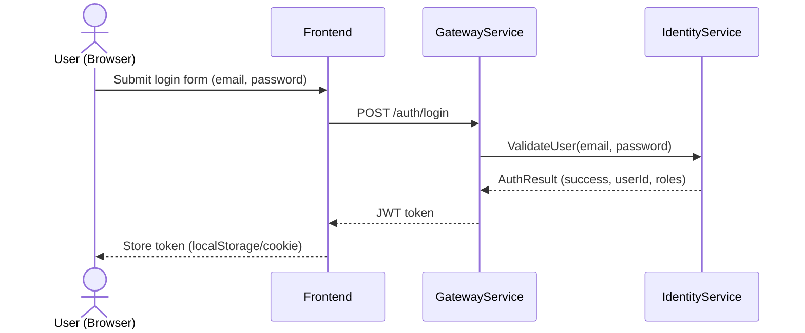
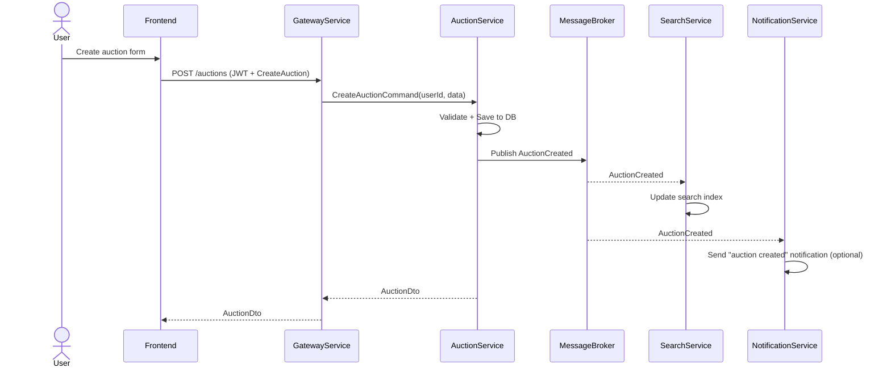
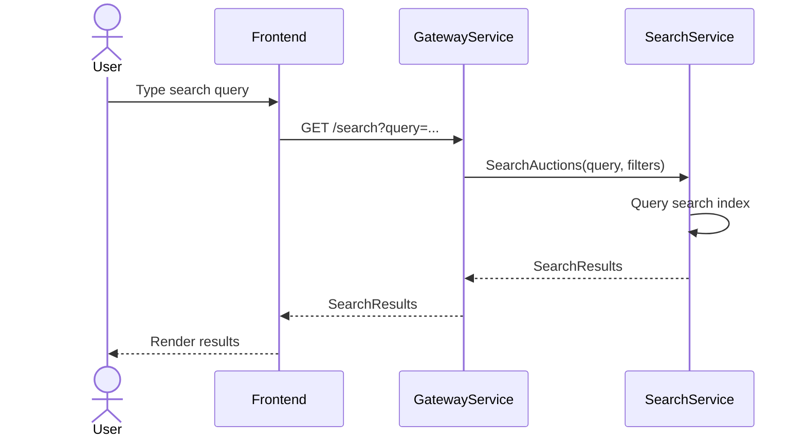
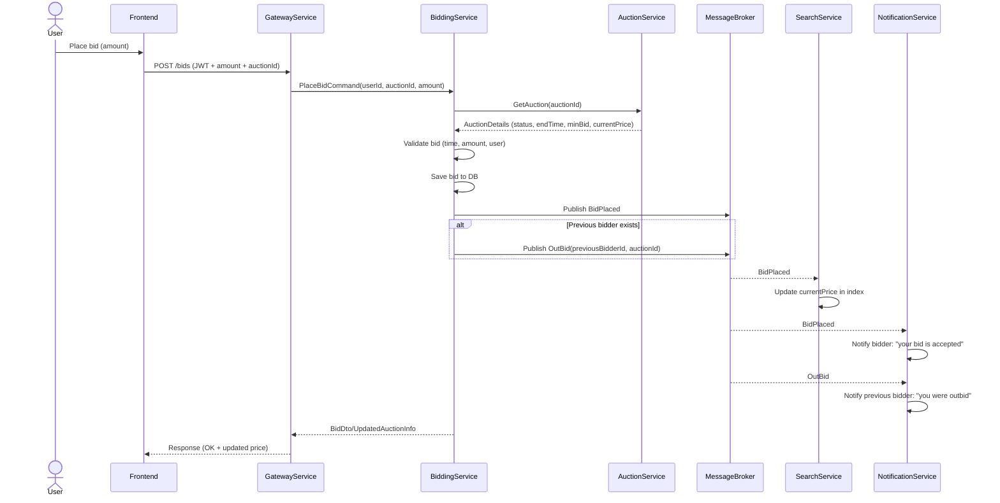

# MicroServices System Architecture Overview

This repository contains a sample microservices system used for learning. The architecture follows a microservices pattern with dedicated services for identity, auctions, bidding, search, notifications, and a gateway. Services communicate asynchronously through RabbitMQ.

## Contents

- `frontend/` — Optional frontend app for consuming the microservices.
- `src/` — Source code for services and libraries:
  - `src/AuctionService/` — ASP.NET Core Web API for auction functionality.
  - `src/Contracts/` — Shared DTOs/interfaces between services (optional).

## Mermaid sequence diagrams

### Login / Getting JWT


### Create Auction


### Search Auctions


### Place Bid


### End Auction
```mermaid
sequenceDiagram
    participant SCH as AuctionScheduler (in AuctionService)
    participant AU as AuctionService
    participant BUS as MessageBroker
    participant BD as BiddingService
    participant NT as NotificationService
    participant SR as SearchService

    SCH->>AU: CheckExpiredAuctions()
    AU->>AU: Find auctions where EndTime <= now AND Status = Active
    loop For each expired auction
        AU->>BD: GetHighestBid(auctionId)
        BD-->>AU: HighestBid or null
        AU->>AU: Set status = Ended, WinnerId, FinalPrice
        AU->>BUS: Publish AuctionEnded(auctionId, sellerId, winnerId, finalPrice)
    end

    BUS-->>NT: AuctionEnded
    NT->>NT:
      Notify seller (auction finished)
      Notify winner (you won)
    BUS-->>SR: AuctionEnded
    SR->>SR: Remove/mark as ended in index
```

## Events

- AuctionCreated → SearchService, NotificationService
- BidPlaced → SearchService, NotificationService
- OutBid → NotificationService
- AuctionEnded → SearchService, NotificationService

## High-Level Flow

- Users authenticate via Identity Service and receive a JWT.
- All client requests go through the Gateway Service which validates JWTs and routes requests to the internal services.
- Services perform domain logic, persist state in dedicated databases, and publish domain events to RabbitMQ.
- Other services subscribe to events and update their own read models or send notifications.

## Components

- Identity Service: authentication, JWT tokens, users (Postgres).
- Gateway Service: API gateway, JWT validation, routing.
- Auction Service: create/manage auctions (Postgres), publish AuctionCreated/AuctionEnded.
- Bidding Service: handle bids, validate business rules (MongoDB).
- Search Service: read-optimized index for searching/filtering (MongoDB).
- Notification Service: subscribes to events, sends notifications (email, push, etc.).
- Event Bus: RabbitMQ for asynchronous pub/sub.

## Example Request Flow

1. User login → Identity Service → JWT.
2. Create auction → Gateway → Auction Service → AuctionCreated event → SearchService indexes → NotificationService (optional).
3. Place a bid → Gateway → Bidding Service → BidPlaced and OutBid events → SearchService updates price → NotificationService notifies.
4. Auction ends → Auction Service publishes AuctionEnded → Search/Notification services react.

## Project Structure

Suggested structure:
```
src/
  AuctionService/
    Controllers/
    DTOs/
    Models/
    Services/
    Repositories/
    Data/ (DbContext)
    Program.cs
    AuctionService.csproj
src/
  Contracts/
tests/
  AuctionService.Tests/
```

## How to scaffold the projects

Run these commands from the repository root (Windows):

```powershell
dotnet new webapi -n AuctionService -o src\AuctionService
dotnet new classlib -n Contracts -o src\Contracts
dotnet new sln -n MicroServices
dotnet sln add src\AuctionService\AuctionService.csproj src\Contracts\Contracts.csproj
```

## Build and run

- Build:
```powershell
dotnet build
```

- Run the API:
```powershell
dotnet run --project src\AuctionService\AuctionService.csproj
```

- Use Postman, curl, or a browser to test endpoints once the API is running.

## Adding tests

- Create test project:
```powershell
dotnet new xunit -n AuctionService.Tests -o tests\AuctionService.Tests
dotnet sln add tests\AuctionService.Tests\AuctionService.Tests.csproj
```

## Tips & Next Steps

- Add a Dockerfile and docker-compose for local integration tests.
- Add EF Core migrations for Postgres (AuctionService).
- Add Swagger/OpenAPI, health checks, and structured logging (Serilog).
- Add CI (GitHub Actions) to run tests and builds.

## Contributing

- Create feature branches and open pull requests.
- Add tests for new functionality and follow coding standards.

## License

Choose a license for the repository (MIT, Apache 2.0, etc.).
